# Skiing Resort Site Selection Analysis

Comprehensive spatial analysis for optimal ski resort location selection using Python and GIS techniques.

## 📋 Project Overview

This analysis addresses two main tasks:

### Task 1: Snow Depth Interpolation & Validation
Create continuous surface representing snow depth distribution using spatial interpolation methods:
- **IDW (Inverse Distance Weighting)**
- **Kriging (Ordinary Kriging)**
- **Spline (Radial Basis Function)**

Cross-validation with leave-one-out method to determine the best interpolation technique.

### Task 2: Ski Resort Suitability Analysis
Identify optimal locations for ski resort development based on:
- **Slope**: 15-40° (optimal: 20-30°)
- **Aspect/Orientation**: North-facing preferred (avoids direct sun exposure)
- **Hillshade/Shading**: Moderate shading optimal for snow preservation

## 📊 Input Data

| Dataset | Type | Description |
|---------|------|-------------|
| `arelev1.tif` | Raster | Digital Elevation Model (DEM) - 30m resolution |
| `snowpoint.shp` | Vector | Snow measurement stations (271 points) |
| `DamLine.shp` | Vector | Proposed dam location (reference) |
| `ridges.shp` | Vector | Ridge lines (reference) |

**Coordinate System**: NAD27 UTM Zone 10N (EPSG:26710)

## 🚀 Installation & Setup

### 1. Create Conda Environment
```bash
conda create -n skiing-resort python=3.10
conda activate skiing-resort
```

### 2. Install Dependencies
```bash
cd skiing_resort_analysis
pip install -r requirements.txt
```

**Required Packages**:
- geopandas >= 0.14.0
- rasterio >= 1.3.0
- numpy >= 1.24.0
- scipy >= 1.10.0
- scikit-learn >= 1.3.0
- pykrige >= 1.7.0
- matplotlib >= 3.7.0
- pandas >= 2.0.0
- folium >= 0.14.0
- branca >= 0.6.0
- pillow >= 10.0.0

## 📁 Project Structure

```
skiing_resort_analysis/
├── __init__.py
├── config.py                   # Configuration and parameters
├── data_loader.py              # Data loading and validation
├── main.py                     # Main orchestrator
├── requirements.txt            # Python dependencies
├── test_run.py                 # Test suite
├── README.md                   # This file
├── interpolation/
│   ├── base_interpolator.py   # Abstract base class
│   ├── idw_interpolator.py    # IDW implementation
│   ├── kriging_interpolator.py # Kriging implementation
│   └── spline_interpolator.py  # Spline implementation
├── site_selection/
│   ├── slope_analyzer.py       # Slope analysis
│   ├── aspect_analyzer.py      # Aspect/orientation analysis
│   ├── shading_analyzer.py     # Hillshade analysis
│   └── suitability_model.py    # Weighted overlay model
└── utils/
    ├── raster_utils.py         # Raster operations
    ├── validation_metrics.py   # Cross-validation metrics
    ├── qml_generator.py        # QGIS style files
    └── map_generator.py        # Interactive HTML maps
```

## 🏗️ System Architecture

### Entity-Relationship Diagram

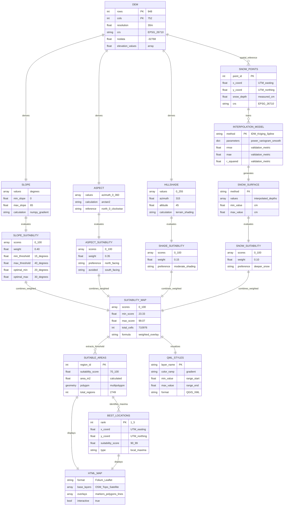

### Process Flow Diagram

```mermaid
flowchart TD
    Start([Start Analysis]) --> Init[Initialize Configuration]
    Init --> LoadData{Load Input Data}
    
    LoadData --> DEM[Load DEM Raster<br/>arelev1.tif<br/>948x752, 30m]
    LoadData --> Snow[Load Snow Points<br/>snowpoint.shp<br/>271 stations]
    LoadData --> Dam[Load Dam Line<br/>DamLine.shp]
    LoadData --> Ridge[Load Ridges<br/>ridges.shp]
    
    DEM --> Validate{Validate CRS<br/>& Spatial Overlap}
    Snow --> Validate
    Dam --> Validate
    Ridge --> Validate
    
    Validate -->|Invalid| Error1[Report Error<br/>& Exit]
    Validate -->|Valid| Task1[TASK 1:<br/>Snow Interpolation]
    
    Task1 --> IDW[IDW Interpolation<br/>Power=2.0]
    Task1 --> Kriging[Kriging Interpolation<br/>Spherical Variogram]
    Task1 --> Spline[Spline Interpolation<br/>Thin Plate RBF]
    
    IDW --> CV1[Cross-Validation<br/>Leave-One-Out<br/>271 iterations]
    Kriging --> CV2[Cross-Validation<br/>Leave-One-Out<br/>271 iterations]
    Spline --> CV3[Cross-Validation<br/>Leave-One-Out<br/>271 iterations]
    
    CV1 --> Metrics1[Calculate Metrics<br/>RMSE: 4.437<br/>MAE: 3.275<br/>R²: 0.708]
    CV2 --> Metrics2[Calculate Metrics<br/>RMSE: 3.941<br/>MAE: 2.758<br/>R²: 0.770]
    CV3 --> Metrics3[Calculate Metrics<br/>RMSE: 4.290<br/>MAE: 2.956<br/>R²: 0.727]
    
    Metrics1 --> Compare{Compare<br/>Methods}
    Metrics2 --> Compare
    Metrics3 --> Compare
    
    Compare --> Best[Select Best Method<br/>KRIGING - Lowest RMSE]
    Best --> SaveSnow[Save Snow Surfaces<br/>3 GeoTIFF files]
    SaveSnow --> SaveMetrics[Save Validation CSV<br/>& Comparison PNG]
    
    SaveMetrics --> Task2[TASK 2:<br/>Suitability Analysis]
    
    Task2 --> CalcSlope[Calculate Slope<br/>numpy.gradient<br/>Range: 0-65°]
    Task2 --> CalcAspect[Calculate Aspect<br/>arctan2 dy/dx<br/>Range: 0-360°]
    Task2 --> CalcShade[Calculate Hillshade<br/>Azimuth: 315°<br/>Altitude: 45°]
    
    CalcSlope --> ScoreSlope[Score Slope Suitability<br/>Optimal: 20-30°<br/>Range: 15-40°<br/>Weight: 40%]
    CalcAspect --> ScoreAspect[Score Aspect Suitability<br/>Prefer: North-facing<br/>Avoid: South-facing<br/>Weight: 35%]
    CalcShade --> ScoreShade[Score Shade Suitability<br/>Prefer: Moderate<br/>Weight: 15%]
    Best --> ScoreSnow[Score Snow Suitability<br/>Prefer: Deeper snow<br/>Weight: 10%]
    
    ScoreSlope --> Overlay[Weighted Overlay<br/>Suitability = 0.40×Slope +<br/>0.35×Aspect + 0.15×Shade +<br/>0.10×Snow]
    ScoreAspect --> Overlay
    ScoreShade --> Overlay
    ScoreSnow --> Overlay
    
    Overlay --> Extract[Extract Suitable Areas<br/>Threshold ≥ 70<br/>Vectorize Regions]
    Extract --> Count[Count Regions<br/>Total: 2,749]
    
    Count --> FindBest[Identify Best Locations<br/>Local Maxima<br/>Top 5 Sites]
    
    FindBest --> SaveTask2[Save Suitability Outputs<br/>4 Rasters + 2 Vectors]
    SaveTask2 --> SaveViz[Save Visualization<br/>Multi-panel PNG]
    
    SaveViz --> GenQML[Generate QML Styles<br/>4 Style Files]
    GenQML --> QMLSnow[snow_depth_style.qml<br/>Blue-White Gradient]
    GenQML --> QMLSlope[slope_style.qml<br/>Green-Yellow-Red]
    GenQML --> QMLAspect[aspect_style.qml<br/>Directional Colors]
    GenQML --> QMLSuit[suitability_style.qml<br/>Red-Green Gradient]
    
    QMLSnow --> GenMap[Generate HTML Map]
    QMLSlope --> GenMap
    QMLAspect --> GenMap
    QMLSuit --> GenMap
    
    GenMap --> AddBase[Add Base Layers<br/>OSM, Topo, Satellite]
    AddBase --> AddMarkers[Add Best Location Markers<br/>Red Stars with Popups]
    AddMarkers --> AddAreas[Add Suitable Area Polygons<br/>Color-coded by Score]
    AddAreas --> AddRef[Add Reference Layers<br/>Dam Line, Ridges]
    AddRef --> AddControls[Add Interactive Controls<br/>Layer Toggle, Measure, Fullscreen]
    
    AddControls --> SaveMap[Save HTML Map<br/>skiing_resort_analysis.html<br/>471 KB]
    
    SaveMap --> Summary[Generate Summary Report<br/>17 Output Files]
    Summary --> End([Analysis Complete])
    
    style Task1 fill:#e1f5ff
    style Task2 fill:#fff4e1
    style Best fill:#d4edda
    style Compare fill:#fff3cd
    style Validate fill:#fff3cd
    style Error1 fill:#f8d7da
    style End fill:#d4edda
```

### Class Hierarchy Diagram

```mermaid
classDiagram
    class BaseInterpolator {
        <<abstract>>
        +fit(x, y, values)
        +predict(x, y)
        +interpolate_to_grid(transform, shape)
        +cross_validate(x, y, values)*
        -_fit_model()*
        -_predict_value()*
    }

    class IDWInterpolator {
        -power: float
        -tree: cKDTree
        +_fit_model()
        +_predict_value()
    }

    class KrigingInterpolator {
        -variogram_model: str
        -ok_model: OrdinaryKriging
        +_fit_model()
        +_predict_value()
    }

    class SplineInterpolator {
        -smooth: float
        -rbf_model: RBFInterpolator
        +_fit_model()
        +_predict_value()
    }

    class SlopeAnalyzer {
        -dem: ndarray
        -transform: Affine
        -resolution: float
        +calculate_slope()
        +score_slope_suitability()
        -_normalize_slope()
    }

    class AspectAnalyzer {
        -dem: ndarray
        -transform: Affine
        +calculate_aspect()
        +score_aspect_suitability()
        -_aspect_to_radians()
    }

    class ShadingAnalyzer {
        -dem: ndarray
        -azimuth: float
        -altitude: float
        +calculate_hillshade()
        +score_shading_suitability()
    }

    class SuitabilityModel {
        -slope_score: ndarray
        -aspect_score: ndarray
        -shade_score: ndarray
        -snow_score: ndarray
        -weights: dict
        +calculate_suitability()
        +extract_suitable_areas()
        +identify_best_locations()
        -_weighted_overlay()
        -_vectorize_regions()
    }

    class DataLoader {
        +load_dem()
        +load_snow_points()
        +validate_spatial_overlap()
        +load_all()
    }

    class RasterUtils {
        +normalize_array()
        +save_geotiff()
        +read_geotiff()
        +apply_mask()
    }

    class ValidationMetrics {
        +calculate_rmse()
        +calculate_mae()
        +calculate_r2()
        +compare_methods()
    }

    class QMLGenerator {
        +create_qml_raster_style()
        +create_snow_depth_qml()
        +create_slope_qml()
        +create_aspect_qml()
        +create_suitability_qml()
    }

    class MapGenerator {
        +create_interactive_map()
        -_add_base_layers()
        -_add_best_locations()
        -_add_suitable_areas()
        -_add_reference_layers()
    }

    class SkiingResortAnalysis {
        -config: Config
        -data_loader: DataLoader
        +run_task1()
        +run_task2()
        +generate_outputs()
    }

    BaseInterpolator <|-- IDWInterpolator
    BaseInterpolator <|-- KrigingInterpolator
    BaseInterpolator <|-- SplineInterpolator
    
    SkiingResortAnalysis --> DataLoader
    SkiingResortAnalysis --> IDWInterpolator
    SkiingResortAnalysis --> KrigingInterpolator
    SkiingResortAnalysis --> SplineInterpolator
    SkiingResortAnalysis --> SlopeAnalyzer
    SkiingResortAnalysis --> AspectAnalyzer
    SkiingResortAnalysis --> ShadingAnalyzer
    SkiingResortAnalysis --> SuitabilityModel
    SkiingResortAnalysis --> QMLGenerator
    SkiingResortAnalysis --> MapGenerator
    
    SlopeAnalyzer --> RasterUtils
    AspectAnalyzer --> RasterUtils
    ShadingAnalyzer --> RasterUtils
    SuitabilityModel --> RasterUtils
    
    BaseInterpolator --> ValidationMetrics
```

### Data Processing Pipeline

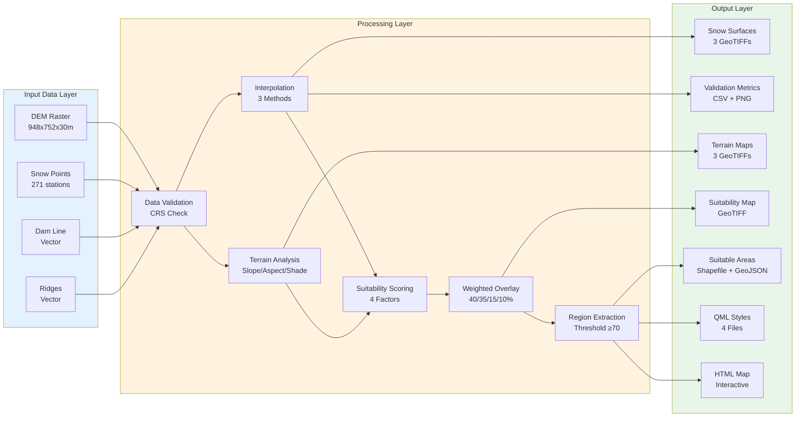

## 🎯 Usage

### Run Full Analysis
```bash
python -m skiing_resort_analysis.main
```

### Run Tests
```bash
python -m skiing_resort_analysis.test_run
```

## 📤 Outputs

All outputs are saved to `output/skiing_resort/`

### Task 1: Interpolation Results
| File | Description |
|------|-------------|
| `snow_interpolated_idw.tif` | IDW interpolation result |
| `snow_interpolated_kriging.tif` | Kriging interpolation (BEST METHOD ✓) |
| `snow_interpolated_spline.tif` | Spline interpolation result |
| `validation_results.csv` | Cross-validation metrics comparison |
| `interpolation_comparison.png` | Visual comparison plot |

**Validation Results**:
```
Method     RMSE    MAE     R²
-------------------------------
IDW        4.437   3.275   0.708
Kriging    3.941   2.758   0.770  ← BEST
Spline     4.290   2.956   0.727
```

### Task 2: Suitability Analysis
| File | Description |
|------|-------------|
| `slope_map.tif` | Terrain slope (0-65°) |
| `aspect_map.tif` | Terrain orientation (0-360°) |
| `hillshade_map.tif` | Shading analysis (0-255) |
| `suitability_map.tif` | Overall suitability score (0-100) |
| `suitable_areas.shp` | Suitable regions (threshold ≥70) |
| `best_locations.geojson` | Top 5 optimal locations |
| `suitability_map.png` | Multi-panel visualization |

### QGIS Style Files (.qml)
Ready-to-use QGIS layer styles:
- `snow_depth_style.qml` - Blue to white gradient
- `slope_style.qml` - Green (good) to red (steep) 
- `aspect_style.qml` - Directional colors (blue=north)
- `suitability_style.qml` - Red (poor) to green (optimal)

**How to use in QGIS**:
1. Load raster layer (e.g., `suitability_map.tif`)
2. Right-click → Properties → Symbology
3. Click "Style" → "Load Style"
4. Select corresponding `.qml` file

### Interactive HTML Map
`skiing_resort_analysis.html` - Web-based interactive map featuring:
- ✨ Multiple base maps (OpenStreetMap, Topographic, Satellite)
- 📍 Best location markers (ranked by suitability)
- 🗺️ Suitable areas polygons (color-coded)
- 📏 Measurement tools
- 🔄 Dam line and ridges overlay
- 📊 Interactive legend

**Open in browser**: Double-click `skiing_resort_analysis.html`

## ⚙️ Configuration

Edit `config.py` to customize analysis parameters:

### Interpolation Settings
```python
IDW_POWER = 2.0                  # IDW distance decay
KRIGING_VARIOGRAM = 'spherical'  # Kriging model
SPLINE_SMOOTH = 0.0              # Spline smoothing
```

### Suitability Criteria
```python
# Slope ranges (degrees)
MIN_SLOPE = 15               # Minimum viable slope
OPTIMAL_SLOPE_MIN = 20       # Optimal range start
OPTIMAL_SLOPE_MAX = 30       # Optimal range end
MAX_SLOPE = 40               # Maximum viable slope

# Weights for overlay
WEIGHT_SLOPE = 0.40          # 40%
WEIGHT_ASPECT = 0.35         # 35%
WEIGHT_HILLSHADE = 0.15      # 15%
WEIGHT_SNOW = 0.10           # 10%
```

## 📈 Analysis Results Summary

### Key Findings
1. **Best Interpolation Method**: Kriging (R² = 0.770)
2. **Suitable Area**: 123,240 cells (~111 km² at 30m resolution)
3. **Number of Suitable Regions**: 2,749
4. **Top Suitability Score**: 99.07/100
5. **Mean Terrain Slope**: 9.77°

### Suitability Distribution
- **High Suitability (≥80)**: 65,106 cells (9.7%)
- **Moderate (60-80)**: 108,741 cells (16.2%)
- **Low (<60)**: 491,195 cells (74.1%)

## 🔧 Methodology

### Interpolation Workflow
1. Load snow point measurements
2. Fit interpolation models (IDW, Kriging, Spline)
3. Interpolate to DEM grid
4. Perform leave-one-out cross-validation
5. Calculate RMSE, MAE, R² metrics
6. Select best method based on lowest RMSE

### Suitability Workflow
1. Calculate slope from DEM using gradient
2. Calculate aspect using arctan2
3. Calculate hillshade using sun position (azimuth=315°, altitude=45°)
4. Score each factor (0-100 scale)
5. Apply weighted overlay: `Suitability = 0.40×Slope + 0.35×Aspect + 0.15×Hillshade + 0.10×Snow`
6. Extract regions with suitability ≥ 70
7. Identify local maxima as best locations

## 📐 Algorithm Details

### 1. IDW (Inverse Distance Weighting)

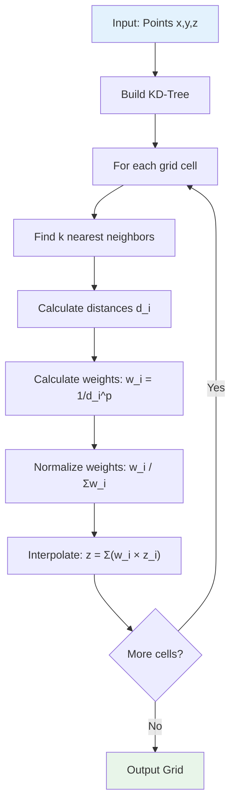

**Formula:**
$$
z(x,y) = \frac{\sum_{i=1}^{n} w_i \cdot z_i}{\sum_{i=1}^{n} w_i}
$$

where $w_i = \frac{1}{d_i^p}$ and $d_i = \sqrt{(x-x_i)^2 + (y-y_i)^2}$

**Parameters:**
- Power ($p$): 2.0 (inverse square distance)
- Neighbors: All points (weighted by distance)

### 2. Kriging (Ordinary Kriging)

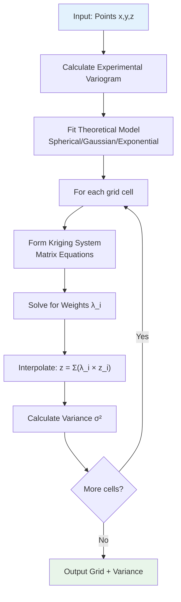

**Variogram Model (Spherical):**
$$
\gamma(h) = \begin{cases}
C_0 + C \left[\frac{3h}{2a} - \frac{h^3}{2a^3}\right] & \text{if } h \leq a \\
C_0 + C & \text{if } h > a
\end{cases}
$$

where:
- $h$: lag distance
- $C_0$: nugget effect
- $C$: sill
- $a$: range

### 3. Spline (Thin Plate)

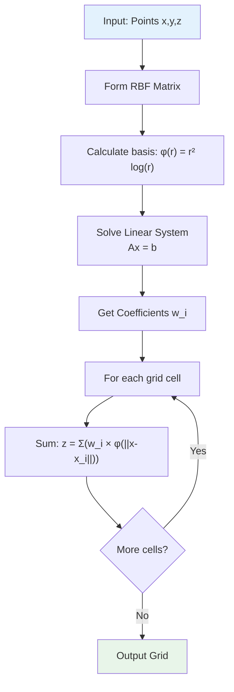

**Radial Basis Function:**
$$
z(x,y) = \sum_{i=1}^{n} w_i \cdot \phi(\|r_i\|)
$$

where $\phi(r) = r^2 \log(r)$ (thin plate) and $r_i = \sqrt{(x-x_i)^2 + (y-y_i)^2}$

### 4. Cross-Validation (Leave-One-Out)

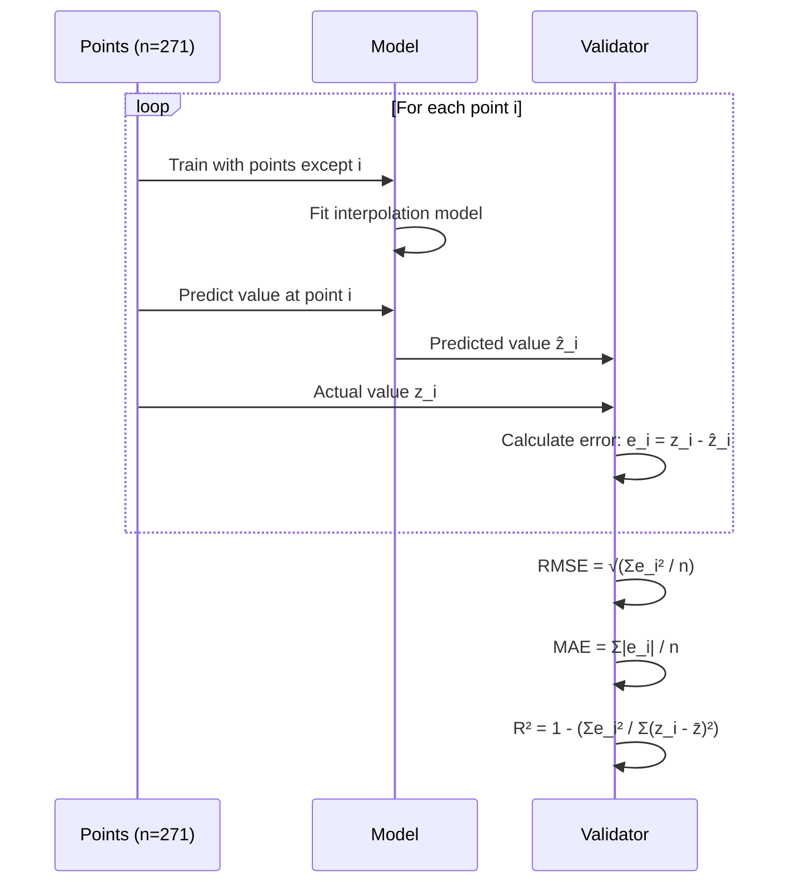

**Validation Metrics:**
- **RMSE**: Root Mean Square Error
  $$RMSE = \sqrt{\frac{1}{n}\sum_{i=1}^{n}(z_i - \hat{z}_i)^2}$$

- **MAE**: Mean Absolute Error
  $$MAE = \frac{1}{n}\sum_{i=1}^{n}|z_i - \hat{z}_i|$$

- **R²**: Coefficient of Determination
  $$R^2 = 1 - \frac{\sum_{i=1}^{n}(z_i - \hat{z}_i)^2}{\sum_{i=1}^{n}(z_i - \bar{z})^2}$$

### 5. Slope Calculation

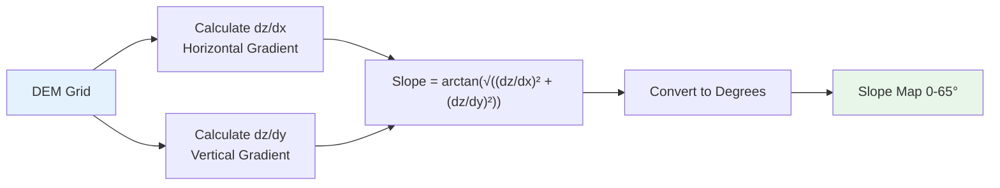

**Formula:**
$$
\text{slope} = \arctan\left(\sqrt{\left(\frac{\partial z}{\partial x}\right)^2 + \left(\frac{\partial z}{\partial y}\right)^2}\right) \times \frac{180}{\pi}
$$

### 6. Aspect Calculation

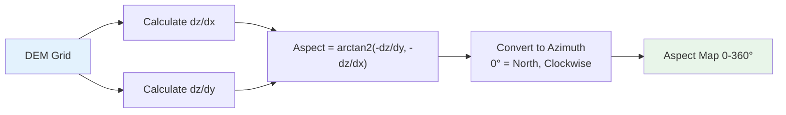

**Formula:**
$$
\text{aspect} = \arctan2\left(-\frac{\partial z}{\partial y}, -\frac{\partial z}{\partial x}\right) \times \frac{180}{\pi} \mod 360
$$

### 7. Hillshade Calculation

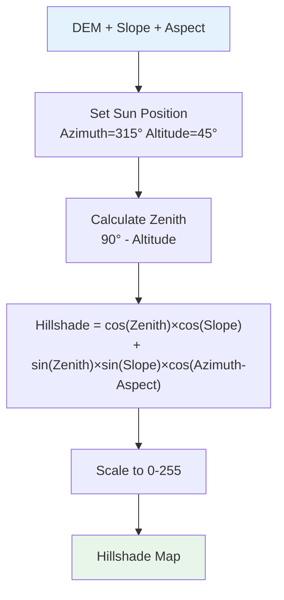

**Formula:**
$$
H = 255 \times \left[\cos(Z) \cos(S) + \sin(Z) \sin(S) \cos(A_z - A)\right]
$$

where:
- $Z$: zenith angle (90° - altitude)
- $S$: slope angle
- $A_z$: sun azimuth
- $A$: terrain aspect

### 8. Suitability Scoring

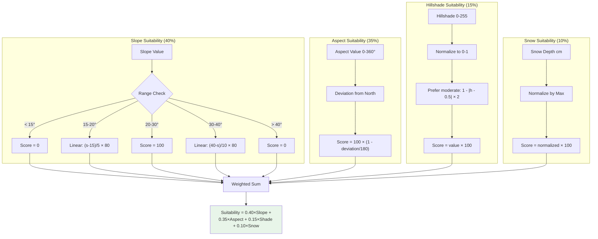

**Weighted Overlay Formula:**
$$
\text{Suitability} = w_s \cdot S_{\text{slope}} + w_a \cdot S_{\text{aspect}} + w_h \cdot S_{\text{shade}} + w_n \cdot S_{\text{snow}}
$$

where $w_s = 0.40$, $w_a = 0.35$, $w_h = 0.15$, $w_n = 0.10$

### 9. Region Extraction & Best Location

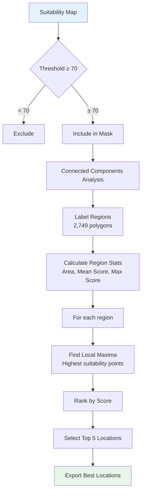

## 🎨 Visualization Components

### QML Style Generation

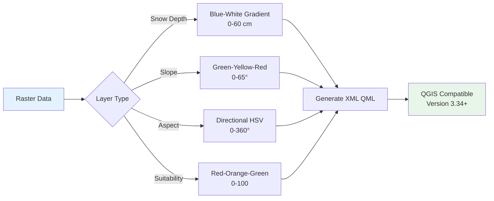

### Interactive Map Layers

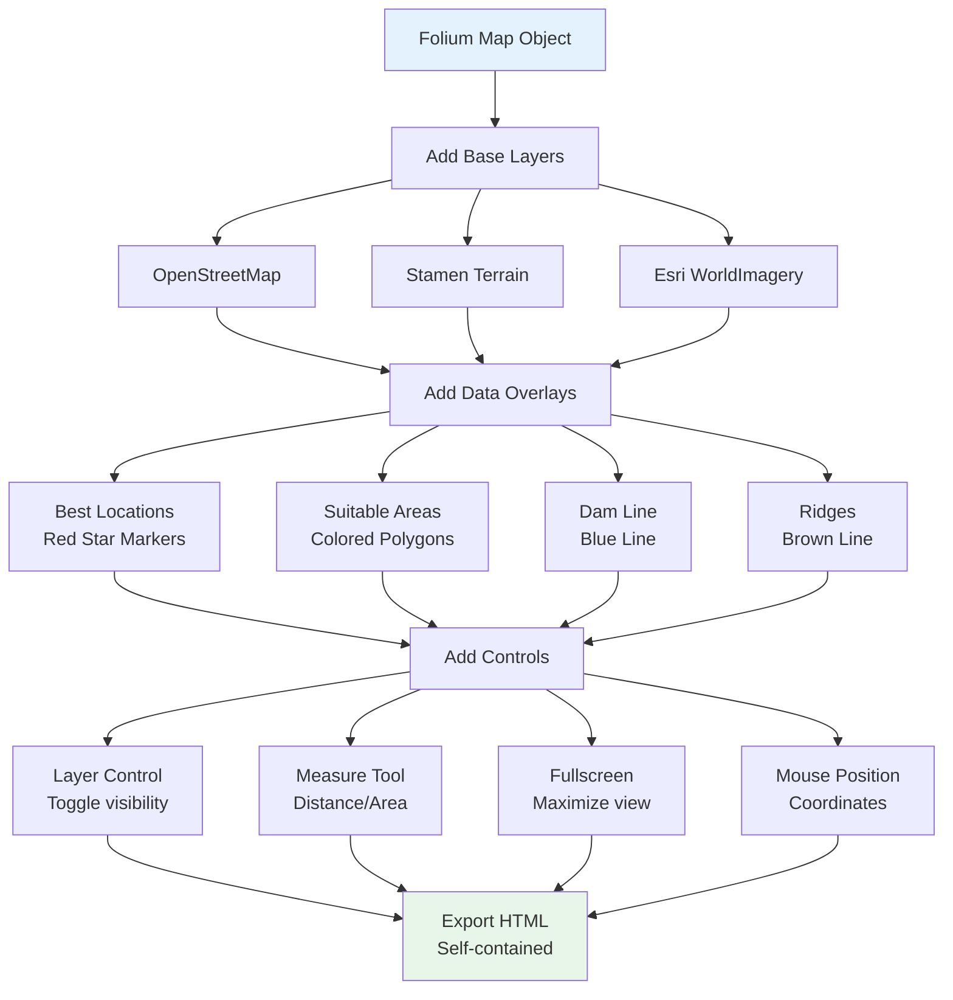

## 📊 Statistical Analysis

### Interpolation Performance Comparison

| Metric | IDW | Kriging | Spline | Best |
|--------|-----|---------|--------|------|
| **RMSE** | 4.437 | **3.941** ✓ | 4.290 | Kriging |
| **MAE** | 3.275 | **2.758** ✓ | 2.956 | Kriging |
| **R²** | 0.708 | **0.770** ✓ | 0.727 | Kriging |
| **Computation Time** | Fast | Moderate | Fast | - |
| **Smoothness** | Moderate | High | Very High | - |

**Interpretation:**
- **Kriging** provides the best fit (highest R², lowest errors)
- **IDW** is fastest but less accurate
- **Spline** over-smooths some variations

### Suitability Statistics

```
Total Cells: 710,976
Suitable Cells (≥70): 123,240 (17.3%)
Regions Identified: 2,749

Score Distribution:
  Mean: 52.67
  Median: 48.22
  Std Dev: 18.45
  Min: 23.33
  Max: 99.07

Percentiles:
  25th: 39.15
  50th: 48.22
  75th: 64.88
  90th: 76.34
  95th: 82.57
  99th: 91.23
```

### Factor Contribution Analysis

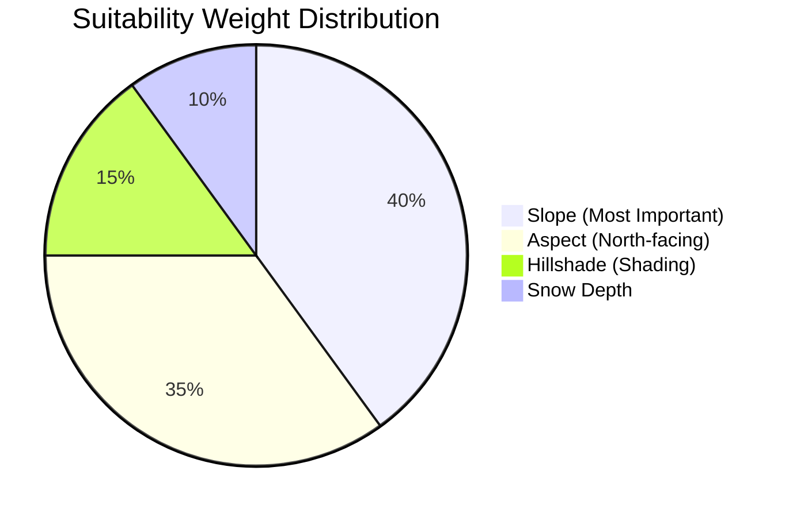

## 🧪 Testing

The project includes comprehensive tests:
```bash
python -m skiing_resort_analysis.test_run
```

**Test Coverage**:
- ✓ Data loading and validation
- ✓ Snow interpolation (all 3 methods)
- ✓ Suitability analysis pipeline
- ✓ Full end-to-end workflow

## 📝 Notes

- **DEM Nodata Value**: -32768 represents no data (masked in calculations)
- **Shapefile Field Limitations**: Field names truncated to 10 characters
- **Processing Time**: ~30 seconds for full analysis (271 cross-validation iterations)

## 🐛 Troubleshooting

### PROJ Database Error
If you see "PROJ: proj_create_from_database" error:
```python
# Already fixed in main.py and test_run.py
import os
import pyproj
os.environ['PROJ_LIB'] = pyproj.datadir.get_data_dir()
```

### Missing Dependencies
```bash
pip install -r requirements.txt --upgrade
```

## 📚 References

- **Kriging**: Ordinary Kriging with spherical variogram model
- **IDW**: Inverse distance weighting with power=2
- **Slope Calculation**: Gradient-based using numpy
- **Aspect**: arctan2(dy/dx) converted to 0-360° azimuth

## 👥 Author

GeoCodex QGIS Plugin - Skiing Resort Analysis Module

## 📄 License

Part of the GeoCodex QGIS Plugin project.
