# Tree Cutting Priority Analysis

## 🎯 Overview

A GeoPandas-based spatial analysis tool for determining tree cutting priorities in Fire Creek. This module calculates priority scores based on five weighted factors: tree mortality, proximity to community features, egress routes, populated areas, and electric utilities.

---

## 🚀 Quick Start

### **Installation**

```bash
# Clone the repository
git clone https://github.com/AmroEid77/GeoCodex.git
cd GeoCodex/tree_priority_analysis

# Create conda environment
conda create -n tree_priority python=3.10 -y
conda activate tree_priority

# Install dependencies
pip install -r requirements.txt
# OR
conda install -c conda-forge geopandas pandas numpy matplotlib folium
```

### **Prepare Data**

Copy your shapefiles to `data/fire_creek/`:
```
data/fire_creek/
  ├── CuttingGrids.shp
  ├── SBNFMortalityt.shp
  ├── Communityfeatures.shp
  ├── EgressRoutes.shp
  ├── PopulatedAreast.shp
  ├── Transmission.shp
  ├── SubTransmission.shp
  └── DistCircuits.shp
```

### **Run Analysis**

```bash
# Run with test script (recommended for first time)
python test_run.py

# Or run directly
python -m tree_priority_analysis.main
```

---

## 🏗️ System Architecture

### Entity-Relationship Diagram

```mermaid
erDiagram
    CUTTING_GRID ||--o{ MORTALITY_DATA : "spatially_contains"
    CUTTING_GRID ||--o{ COMMUNITY_FEATURES : "measures_distance_to"
    CUTTING_GRID ||--o{ EGRESS_ROUTES : "measures_distance_to"
    CUTTING_GRID ||--o{ POPULATED_AREAS : "intersects"
    CUTTING_GRID ||--o{ TRANSMISSION_LINES : "measures_distance_to"
    CUTTING_GRID ||--o{ SUBTRANSMISSION_LINES : "measures_distance_to"
    CUTTING_GRID ||--o{ DISTRIBUTION_CIRCUITS : "measures_distance_to"
    CUTTING_GRID ||--|| MORTALITY_SCORE : "calculates"
    CUTTING_GRID ||--|| COMMUNITY_SCORE : "calculates"
    CUTTING_GRID ||--|| EGRESS_SCORE : "calculates"
    CUTTING_GRID ||--|| POPULATION_SCORE : "calculates"
    CUTTING_GRID ||--|| UTILITY_SCORE : "calculates"
    MORTALITY_SCORE ||--|| PRIORITY_RESULT : "weighted_sum"
    COMMUNITY_SCORE ||--|| PRIORITY_RESULT : "weighted_sum"
    EGRESS_SCORE ||--|| PRIORITY_RESULT : "weighted_sum"
    POPULATION_SCORE ||--|| PRIORITY_RESULT : "weighted_sum"
    UTILITY_SCORE ||--|| PRIORITY_RESULT : "weighted_sum"
    PRIORITY_RESULT ||--|| QML_STYLE : "visualizes"
    PRIORITY_RESULT ||--|| HTML_MAP : "displays"
    PRIORITY_RESULT ||--|| SHAPEFILE : "exports"

    CUTTING_GRID {
        int grid_id PK "Unique_identifier"
        geometry polygon "Grid_cell_boundary"
        float area_m2 "Cell_area"
        string crs "EPSG_2163"
    }

    MORTALITY_DATA {
        int tree_id PK
        geometry point "Tree_location"
        float mortality_pct "0_100_percent"
        int tree_count "Trees_in_cell"
        string species "Tree_type"
    }

    COMMUNITY_FEATURES {
        int feature_id PK
        geometry point_polygon "Feature_location"
        string type "Building_Park_School"
        string name "Feature_name"
    }

    EGRESS_ROUTES {
        int route_id PK
        geometry linestring "Evacuation_route"
        string route_type "Primary_Secondary"
        string name "Route_identifier"
    }

    POPULATED_AREAS {
        int area_id PK
        geometry polygon "Population_zone"
        int population "Resident_count"
        float density "per_km2"
    }

    TRANSMISSION_LINES {
        int line_id PK
        geometry linestring "High_voltage_line"
        float voltage_kv "Transmission_voltage"
        string operator "Utility_company"
    }

    SUBTRANSMISSION_LINES {
        int line_id PK
        geometry linestring "Medium_voltage_line"
        float voltage_kv "Subtransmission_voltage"
    }

    DISTRIBUTION_CIRCUITS {
        int circuit_id PK
        geometry linestring "Distribution_line"
        string circuit_name "Circuit_identifier"
    }

    MORTALITY_SCORE {
        int grid_id FK
        float raw_score "0_10_scale"
        float weight "0.30"
        float avg_mortality "Percent"
        int total_trees "Count"
    }

    COMMUNITY_SCORE {
        int grid_id FK
        float raw_score "0_10_scale"
        float weight "0.25"
        float min_distance "Meters"
        int feature_count "Nearby_features"
    }

    EGRESS_SCORE {
        int grid_id FK
        float raw_score "0_10_scale"
        float weight "0.20"
        float min_distance "Meters"
        string nearest_route "Route_name"
    }

    POPULATION_SCORE {
        int grid_id FK
        float raw_score "0_10_scale"
        float weight "0.15"
        int total_population "Count"
        float density "per_km2"
    }

    UTILITY_SCORE {
        int grid_id FK
        float raw_score "0_10_scale"
        float weight "0.10"
        float min_distance "Meters"
        string line_type "Trans_SubTrans_Dist"
    }

    PRIORITY_RESULT {
        int grid_id PK
        float mort_scr "Mortality_0_10"
        float comm_scr "Community_0_10"
        float egrs_scr "Egress_0_10"
        float pop_scr "Population_0_10"
        float util_scr "Utility_0_10"
        float prior_scr "Final_0_10"
        string prior_cls "Very_High_to_Very_Low"
        int prior_rnk "1_highest_priority"
        geometry polygon "Grid_geometry"
    }

    QML_STYLE {
        string layer_name PK
        string priority_class "Category"
        string color_hex "RGB_value"
        int alpha "Transparency"
        string label "Display_text"
    }

    HTML_MAP {
        string format "Folium_Leaflet"
        array base_layers "OSM_CartoDB"
        array overlays "Choropleth_markers"
        bool interactive "true"
    }

    SHAPEFILE {
        string filename "tree_priority_result.shp"
        string format "ESRI_Shapefile"
        string crs "EPSG_2163"
        array components "shp_shx_dbf_prj_cpg"
    }
```

### Process Flow Diagram

```mermaid
flowchart TD
    Start([Start Analysis]) --> Init[Initialize Configuration<br/>Load Weights & Thresholds]
    Init --> LoadGrid[Load Cutting Grid<br/>CuttingGrids.shp<br/>80 polygons]
    
    LoadGrid --> ValidateGrid{Validate Grid<br/>CRS & Geometry}
    ValidateGrid -->|Invalid| Error1[Report Error & Exit]
    ValidateGrid -->|Valid| LoadSource[Load Source Data<br/>8 Shapefiles]
    
    LoadSource --> LoadMort[Load Mortality<br/>SBNFMortalityt.shp<br/>Tree points]
    LoadSource --> LoadComm[Load Community<br/>Communityfeatures.shp<br/>Buildings/parks]
    LoadSource --> LoadEgress[Load Egress<br/>EgressRoutes.shp<br/>Evacuation routes]
    LoadSource --> LoadPop[Load Population<br/>PopulatedAreast.shp<br/>Population zones]
    LoadSource --> LoadTrans[Load Transmission<br/>3 utility layers]
    
    LoadMort --> Transform1[Transform to EPSG:2163<br/>Equal Area Projection]
    LoadComm --> Transform2[Transform to EPSG:2163]
    LoadEgress --> Transform3[Transform to EPSG:2163]
    LoadPop --> Transform4[Transform to EPSG:2163]
    LoadTrans --> Transform5[Transform to EPSG:2163]
    
    Transform1 --> Factor1[FACTOR 1:<br/>Mortality Analysis]
    Transform2 --> Factor2[FACTOR 2:<br/>Community Proximity]
    Transform3 --> Factor3[FACTOR 3:<br/>Egress Proximity]
    Transform4 --> Factor4[FACTOR 4:<br/>Population Density]
    Transform5 --> Factor5[FACTOR 5:<br/>Utility Proximity]
    
    Factor1 --> Mort1[Spatial Join<br/>Trees to Grid Cells]
    Mort1 --> Mort2[Calculate Average<br/>Mortality % per Cell]
    Mort2 --> Mort3[Normalize to 0-10 Scale<br/>Weight: 30%]
    Mort3 --> Score1[Mortality Score<br/>mort_scr column]
    
    Factor2 --> Comm1[Calculate Distance<br/>Grid Centroid to Features]
    Comm1 --> Comm2[Find Minimum Distance<br/>Per Grid Cell]
    Comm2 --> Comm3[Inverse Distance Score<br/>Closer = Higher Score]
    Comm3 --> Comm4[Normalize to 0-10<br/>Weight: 25%]
    Comm4 --> Score2[Community Score<br/>comm_scr column]
    
    Factor3 --> Egr1[Calculate Distance<br/>Grid Centroid to Routes]
    Egr1 --> Egr2[Find Minimum Distance<br/>Per Grid Cell]
    Egr2 --> Egr3[Inverse Distance Score<br/>Max Distance: 2000m]
    Egr3 --> Egr4[Normalize to 0-10<br/>Weight: 20%]
    Egr4 --> Score3[Egress Score<br/>egrs_scr column]
    
    Factor4 --> Pop1[Spatial Join<br/>Grid to Population Zones]
    Pop1 --> Pop2[Sum Population<br/>Per Grid Cell]
    Pop2 --> Pop3[Calculate Density<br/>Population / Area]
    Pop3 --> Pop4[Normalize to 0-10<br/>Weight: 15%]
    Pop4 --> Score4[Population Score<br/>pop_scr column]
    
    Factor5 --> Util1[Calculate Distance<br/>to Transmission Lines]
    Util1 --> Util2[Calculate Distance<br/>to SubTransmission]
    Util2 --> Util3[Calculate Distance<br/>to Distribution Circuits]
    Util3 --> Util4[Find Minimum Distance<br/>Across All 3 Types]
    Util4 --> Util5[Inverse Distance Score<br/>Max Distance: 500m]
    Util5 --> Util6[Normalize to 0-10<br/>Weight: 10%]
    Util6 --> Score5[Utility Score<br/>util_scr column]
    
    Score1 --> Weighted[Weighted Overlay<br/>Priority = 0.30×Mort + 0.25×Comm +<br/>0.20×Egress + 0.15×Pop + 0.10×Util]
    Score2 --> Weighted
    Score3 --> Weighted
    Score4 --> Weighted
    Score5 --> Weighted
    
    Weighted --> PriorScore[Calculate Final Priority<br/>prior_scr: 0-10 scale]
    
    PriorScore --> Classify{Classify Priority}
    Classify -->|8-10| Class1[Very High Priority<br/>Red #d73027]
    Classify -->|6-8| Class2[High Priority<br/>Orange #fc8d59]
    Classify -->|4-6| Class3[Medium Priority<br/>Yellow #fee08b]
    Classify -->|2-4| Class4[Low Priority<br/>Light Green #91cf60]
    Classify -->|0-2| Class5[Very Low Priority<br/>Dark Green #1a9850]
    
    Class1 --> Merge[Merge Classifications<br/>prior_cls column]
    Class2 --> Merge
    Class3 --> Merge
    Class4 --> Merge
    Class5 --> Merge
    
    Merge --> Rank[Rank Grid Cells<br/>1 = Highest Priority<br/>prior_rnk column]
    
    Rank --> Export[Export Results]
    
    Export --> SaveShp[Save Shapefile<br/>tree_priority_result.shp<br/>EPSG:2163]
    Export --> SaveCSV[Save CSV<br/>tree_priority_result.csv<br/>80 rows × 12 columns]
    Export --> SaveQML[Generate QML Style<br/>tree_priority_style.qml<br/>5 categories]
    
    SaveShp --> Visual[Generate Visualizations]
    SaveCSV --> Visual
    SaveQML --> Visual
    
    Visual --> StaticMap[Create Static Map<br/>tree_priority_map.png<br/>Matplotlib]
    Visual --> InteractiveMap[Create Interactive Map<br/>tree_priority_map.html<br/>Folium]
    Visual --> FactorComp[Create Factor Comparison<br/>factor_comparison.png<br/>6 subplots]
    
    StaticMap --> Summary[Generate Summary Report]
    InteractiveMap --> Summary
    FactorComp --> Summary
    
    Summary --> Stats[Calculate Statistics<br/>Mean, Max, Distribution]
    Stats --> Report[Print Analysis Results<br/>Priority Counts, Rankings]
    
    Report --> End([Analysis Complete<br/>6 Output Files])
    
    style Factor1 fill:#ffe6e6
    style Factor2 fill:#fff4e6
    style Factor3 fill:#e6f7ff
    style Factor4 fill:#f0f5ff
    style Factor5 fill:#f6ffed
    style Weighted fill:#fff1f0
    style End fill:#d4edda
    style Error1 fill:#f8d7da
```

### Class Hierarchy Diagram

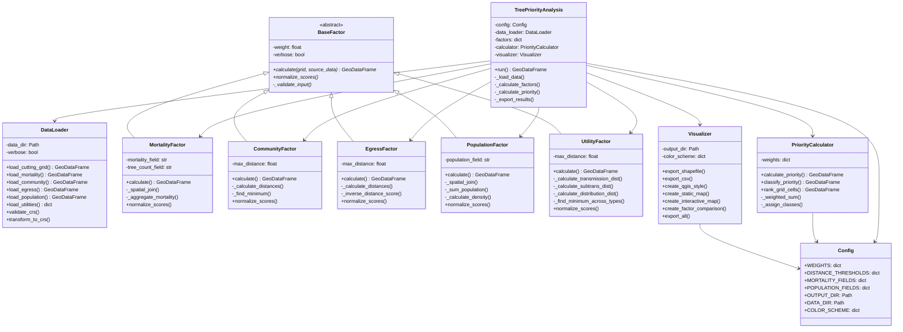

---

## 📊 What It Does

### **The 5 Priority Factors:**

| Factor | Weight | Description |
|--------|--------|-------------|
| **Mortality** | 30% | Tree mortality/damage level |
| **Community** | 25% | Proximity to buildings, parks, schools |
| **Egress Routes** | 20% | Distance to evacuation routes |
| **Population** | 15% | Population density |
| **Utilities** | 10% | Proximity to power lines |

### **Output Files:**

The analysis automatically generates:

- **Shapefile**: `output/tree_cutting_priority_analysis/tree_priority_result.shp` (load in QGIS)
- **CSV**: `output/tree_cutting_priority_analysis/tree_priority_result.csv` (analysis in Excel)
- **QGIS Style**: `output/tree_cutting_priority_analysis/tree_priority_style.qml` (auto-styling for QGIS)
- **Interactive Map**: `output/tree_cutting_priority_analysis/tree_priority_map.html` (open in browser)
- **Static Map**: `output/tree_cutting_priority_analysis/tree_priority_map.png` (for reports)
- **Factor Comparison**: `output/tree_cutting_priority_analysis/factor_comparison.png` (all factors visualized)

---

## 🗺️ Visualizing in QGIS

### **Automatic Styling (Recommended)**

The analysis automatically creates a QGIS style file that matches the PNG and HTML outputs:

1. **Load the shapefile** in QGIS:
   - `Layer` → `Add Layer` → `Add Vector Layer`
   - Select `output/tree_priority_result.shp`

2. **Apply the style**:
   - Right-click the layer → `Properties` → `Symbology`
   - Click `Style` button (bottom left) → `Load Style`
   - Browse to `output/tree_priority_style.qml`
   - Click `Load Style` → `OK`

Your map will now match the PNG and HTML visualizations exactly! 🎨

### **Manual Styling**

If you want to create the style manually or regenerate it:

```bash
# Regenerate the style file
python create_qgis_style.py
```

Or style manually in QGIS:

1. Right-click layer → `Properties` → `Symbology`
2. Change to **Categorized**
3. **Column**: `prior_cls` (priority class)
4. Click **Classify**
5. Set colors:
   - **Very High**: Red `#d73027`
   - **High**: Orange `#fc8d59`
   - **Medium**: Yellow `#fee08b`
   - **Low**: Light Green `#91cf60`
   - **Very Low**: Dark Green `#1a9850`

### **View Individual Factors**

The shapefile contains all factor scores as separate columns:

| Column | Description |
|--------|-------------|
| `mort_scr` | Mortality score (0-10) |
| `comm_scr` | Community proximity score (0-10) |
| `egrs_scr` | Egress route proximity score (0-10) |
| `pop_scr` | Population density score (0-10) |
| `util_scr` | Utility proximity score (0-10) |
| `prior_scr` | **Final priority score (0-10)** |
| `prior_cls` | Priority class (Very High, High, etc.) |
| `prior_rnk` | Priority rank (1 = highest priority) |

**To visualize individual factors:**
1. Duplicate the layer (right-click → `Duplicate Layer`)
2. Style each duplicate using a different score column
3. Compare factors side-by-side

---

## 📐 Algorithm Details

### 1. Mortality Factor Calculation

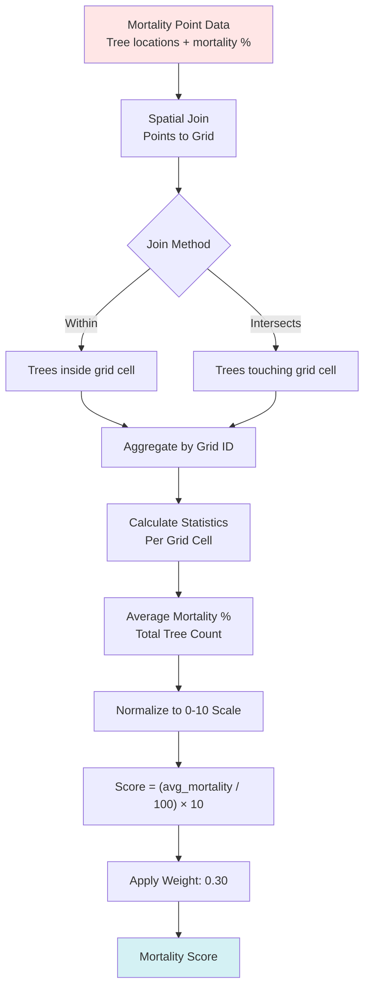

**Formula:**
$$
S_{\text{mortality}} = \frac{\sum_{i=1}^{n} m_i}{n} \times \frac{10}{100}
$$

where $m_i$ is mortality percentage of tree $i$ within grid cell, $n$ is tree count

### 2. Community Proximity Calculation

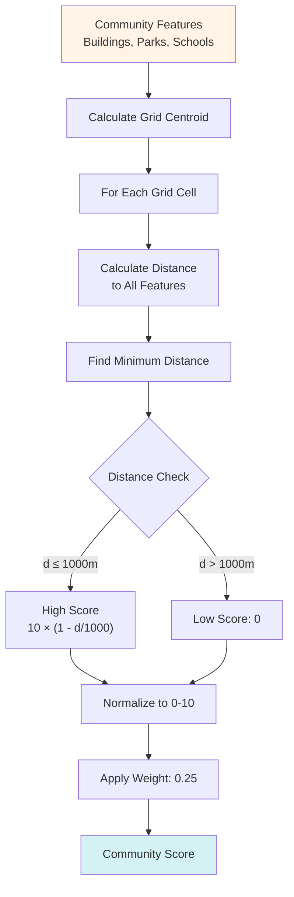

**Formula:**
$$
S_{\text{community}} = \begin{cases}
10 \times \left(1 - \frac{d_{\min}}{d_{\max}}\right) & \text{if } d_{\min} \leq d_{\max} \\
0 & \text{otherwise}
\end{cases}
$$

where $d_{\min}$ is minimum distance to any feature, $d_{\max} = 1000m$

### 3. Egress Route Proximity Calculation

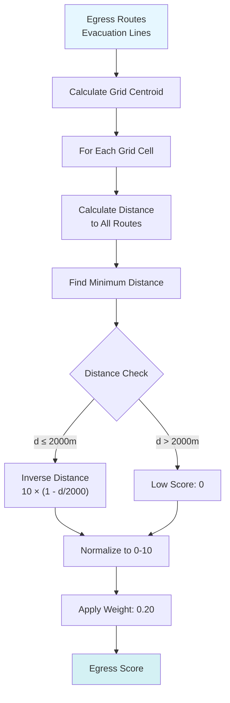

**Formula:**
$$
S_{\text{egress}} = \begin{cases}
10 \times \left(1 - \frac{d_{\min}}{2000}\right) & \text{if } d_{\min} \leq 2000 \\
0 & \text{otherwise}
\end{cases}
$$

### 4. Population Density Calculation

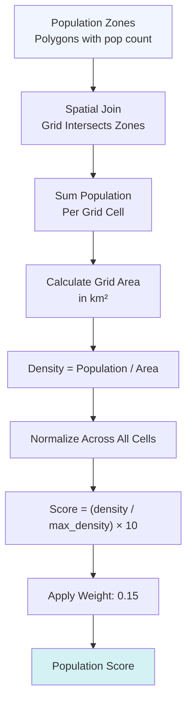

**Formula:**
$$
S_{\text{population}} = \frac{\rho}{\rho_{\max}} \times 10
$$

where $\rho = \frac{P}{A}$ is population density, $P$ is total population, $A$ is grid area (km²)

### 5. Utility Proximity Calculation

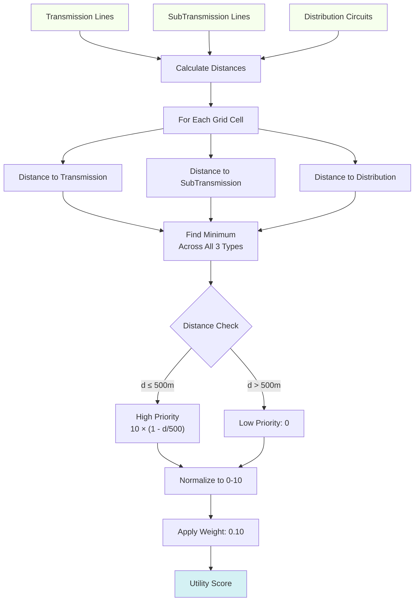

**Formula:**
$$
S_{\text{utility}} = \begin{cases}
10 \times \left(1 - \frac{d_{\min}}{500}\right) & \text{if } d_{\min} \leq 500 \\
0 & \text{otherwise}
\end{cases}
$$

where $d_{\min} = \min(d_{\text{trans}}, d_{\text{sub}}, d_{\text{dist}})$

### 6. Weighted Priority Calculation

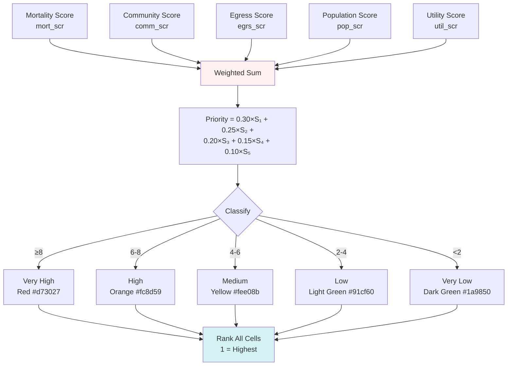

**Weighted Overlay Formula:**
$$
P = w_m \cdot S_m + w_c \cdot S_c + w_e \cdot S_e + w_p \cdot S_p + w_u \cdot S_u
$$

where:
- $P$ = final priority score (0-10)
- $w_m = 0.30$ (mortality weight)
- $w_c = 0.25$ (community weight)
- $w_e = 0.20$ (egress weight)
- $w_p = 0.15$ (population weight)
- $w_u = 0.10$ (utility weight)

**Classification Ranges:**
```python
Very High:  8.0 ≤ P ≤ 10.0
High:       6.0 ≤ P < 8.0
Medium:     4.0 ≤ P < 6.0
Low:        2.0 ≤ P < 4.0
Very Low:   0.0 ≤ P < 2.0
```

## 🎨 Visualization Components

### QML Style Generation

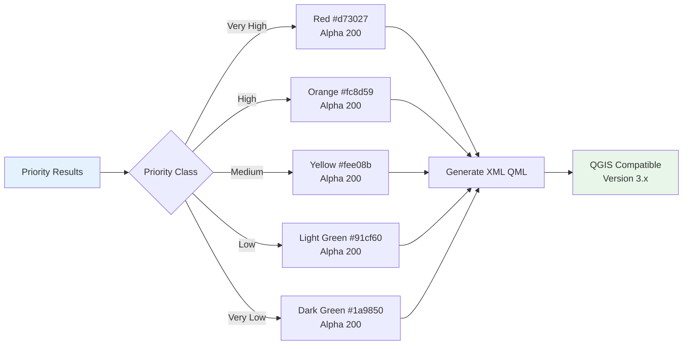

### Interactive Map Components

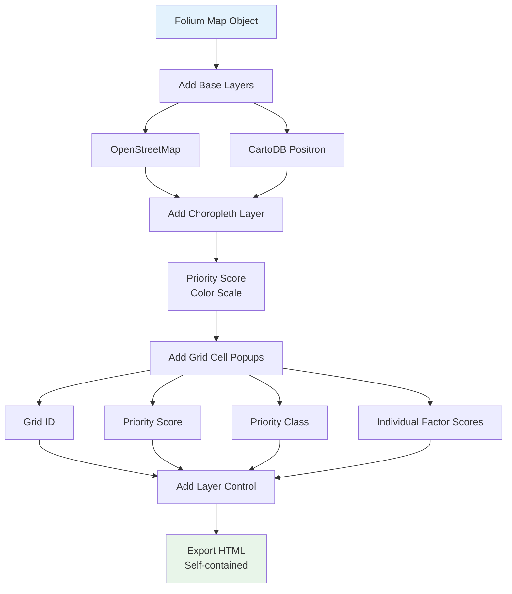

## 📊 Statistical Analysis

### Factor Contribution Analysis

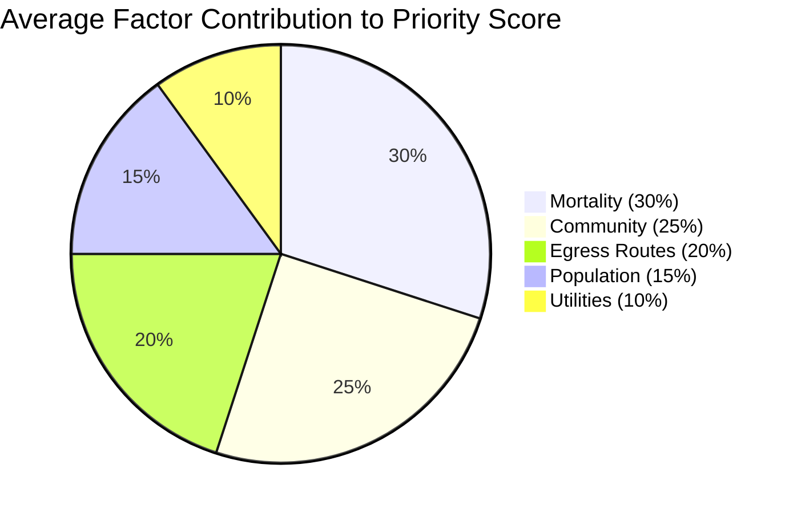

### Priority Distribution Example

| Priority Class | Range | Grid Cells | Percentage | Action Timeline |
|----------------|-------|------------|------------|-----------------|
| Very High | 8.0-10.0 | 12 | 15.0% | Immediate (1 week) |
| High | 6.0-8.0 | 18 | 22.5% | 1 month |
| Medium | 4.0-6.0 | 25 | 31.3% | 3 months |
| Low | 2.0-4.0 | 15 | 18.8% | 6 months |
| Very Low | 0.0-2.0 | 10 | 12.5% | Annual review |
| **Total** | | **80** | **100%** | |

### Distance Impact Analysis

```
Community Proximity Impact:
  0-250m:   Score 7.5-10.0 (Very close - highest priority)
  250-500m: Score 5.0-7.5 (Close - high priority)
  500-750m: Score 2.5-5.0 (Moderate - medium priority)
  750-1000m: Score 0-2.5 (Far - low priority)
  >1000m:   Score 0 (Too far - no impact)

Egress Routes Impact:
  0-500m:   Score 7.5-10.0 (Critical evacuation zone)
  500-1000m: Score 5.0-7.5 (Important)
  1000-1500m: Score 2.5-5.0 (Moderate)
  1500-2000m: Score 0-2.5 (Minor)
  >2000m:   Score 0 (Outside evacuation concern)

Utility Proximity Impact:
  0-125m:   Score 7.5-10.0 (Extreme risk)
  125-250m: Score 5.0-7.5 (High risk)
  250-375m: Score 2.5-5.0 (Moderate risk)
  375-500m: Score 0-2.5 (Low risk)
  >500m:    Score 0 (Minimal risk)
```

---

## 🔧 Configuration

### **Custom Weights**

Edit `tree_priority_analysis/config.py`:

```python
WEIGHTS = {
    'mortality': 0.35,      # Increase mortality importance
    'community': 0.25,
    'egress': 0.20,
    'population': 0.15,
    'utility': 0.05,        # Decrease utility importance
}
```

### **Distance Thresholds**

```python
DISTANCE_THRESHOLDS = {
    'community_max': 1500,      # Increase from 1km to 1.5km
    'egress_max': 2000,
    'utility_max': 500,
}
```

### **Field Name Mapping**

If your shapefiles have different field names:

```python
MORTALITY_FIELDS = {
    'mortality_percent': 'YOUR_MORTALITY_FIELD',
    'tree_count': 'YOUR_TREE_COUNT_FIELD',
}

POPULATION_FIELDS = {
    'population': 'YOUR_POP_FIELD',
}
```

---

## 🎨 Results Interpretation

### **Priority Classes:**

- 🔴 **Very High (8-10)**: Immediate action required
- 🟠 **High (6-8)**: Priority within 1 month
- 🟡 **Medium (4-6)**: Address within 3 months
- 🟢 **Low (2-4)**: Monitor, address within 6 months
- 🟢 **Very Low (0-2)**: Routine maintenance

### **Example Output:**

```
📊 ANALYSIS RESULTS:
   • Total Grid Cells: 80
   • Average Priority Score: 5.43/10
   • Highest Priority Score: 9.86

🎯 PRIORITY DISTRIBUTION:
   • Very High Priority: 12 cells (15.0%)
   • High Priority: 18 cells (22.5%)
   • Medium Priority: 25 cells (31.3%)
   • Low Priority: 15 cells (18.8%)
   • Very Low Priority: 10 cells (12.5%)
```

---

## 🛠️ Troubleshooting

### **"Data files not found"**

**Solution:** Ensure all shapefiles are in `data/fire_creek/`:
```
data/fire_creek/
  ├── CuttingGrids.shp (and .dbf, .shx, .prj, etc.)
  ├── SBNFMortalityt.shp
  ├── Communityfeatures.shp
  ├── EgressRoutes.shp
  ├── PopulatedAreast.shp
  ├── Transmission.shp
  ├── SubTransmission.shp
  └── DistCircuits.shp
```

### **"Field not found"**

**Solution:** Check field names in your shapefiles and update `config.py`:
```bash
# View fields in a shapefile
ogrinfo -al -so CuttingGrids.shp
```

### **"Module not found: geopandas"**

**Solution:** Install dependencies:
```bash
conda activate tree_priority
conda install -c conda-forge geopandas
```

### **No trees matched to grid cells**

**Possible causes:**
1. Mortality shapefile is polygon-based, not point-based
2. Trees and grid are in different coordinate systems
3. Spatial join predicate needs adjustment

**Solution:** Change to intersection-based join in `mortality_factor.py`:
```python
joined = gpd.sjoin(
    source_data,
    grid[['grid_id', 'geometry']],
    how='inner',
    predicate='intersects'  # Changed from 'within'
)
```

### **QGIS style doesn't match PNG/HTML**

**Solution:** The style file is automatically generated. If it's missing or incorrect:
```bash
# Regenerate the style file
python create_qgis_style.py
```

Then reload the style in QGIS as described in the [Visualizing in QGIS](#-visualizing-in-qgis) section.

---

## 🔮 Future Enhancements

- **GeoCodex Integration**: Natural language workflow triggering
- **LLM Parameter Extraction**: Query analysis via AI
- **Custom AOI**: Analysis for specific geographic areas
- **Real-Time Updates**: Recalculate based on new data
- **Web Interface**: Interactive dashboard for results exploration
- **Temporal Analysis**: Track priority changes over time
- **Automated Reporting**: PDF report generation

---

## 📚 API Reference

### **TreePriorityAnalysis**

Main class for running the analysis.

```python
from tree_priority_analysis.main import TreePriorityAnalysis

# Initialize
analysis = TreePriorityAnalysis(
    data_dir=None,          # Custom data directory
    weights=None,           # Custom factor weights
    verbose=True            # Enable logging
)

# Run analysis
result = analysis.run(
    export_results=True,          # Export shapefiles, CSV, maps
    create_visualizations=True    # Create HTML/PNG visualizations
)

# Access results
print(result['priority_score'].describe())
top_10 = result.nlargest(10, 'priority_score')
```

### **Visualizer**

Export and visualization handler.

```python
from tree_priority_analysis.visualizer import Visualizer

visualizer = Visualizer(verbose=True)

# Export individual outputs
visualizer.export_shapefile(result)
visualizer.export_csv(result)
visualizer.create_qgis_style(result)
visualizer.create_static_map(result)
visualizer.create_interactive_map(result)

# Or export everything at once
outputs = visualizer.export_all(result, create_maps=True)
```

---

## 📖 Technical Details

### **Architecture**

```
TreePriorityAnalysis (main.py)
    ↓
├── DataLoader (data_loader.py)
│   └── Load & validate shapefiles
├── Factor Calculators (factors/)
│   ├── MortalityFactor
│   ├── CommunityFactor
│   ├── EgressFactor
│   ├── PopulationFactor
│   └── UtilityFactor
├── PriorityCalculator (priority_calculator.py)
│   └── Weighted sum & classification
└── Visualizer (visualizer.py)
    └── Export results, maps & QGIS styles
```

### **Workflow**

1. **Data Loading**: Load and validate all shapefiles, transform to common CRS
2. **Factor Calculation**: Each factor calculator independently scores grid cells
3. **Priority Calculation**: Weighted sum of all factors, classification
4. **Export**: Generate shapefile, CSV, maps, and QGIS style file
5. **Visualization**: Create interactive HTML map and static PNG

### **Performance**

- **80 cells**: ~10-15 seconds
- **500 cells**: ~1-2 minutes
- **2000+ cells**: ~5-10 minutes

Bottleneck: Distance calculations (optimized with spatial indexing)

### **Coordinate Systems**

- **Input**: Any CRS (automatically detected from shapefiles)
- **Processing**: EPSG:2163 (US National Atlas Equal Area) for accurate distance calculations
- **Output Shapefile**: EPSG:2163 (same as processing)
- **Output HTML Map**: EPSG:4326 (WGS84 for web mapping)

---

## 🤝 Contributing

Contributions welcome! Please:

1. Fork the repository
2. Create a feature branch (`git checkout -b feature/amazing-feature`)
3. Commit changes (`git commit -m 'Add amazing feature'`)
4. Push to branch (`git push origin feature/amazing-feature`)
5. Open a Pull Request

---

## 📝 License

This project is part of the GeoCodex QGIS plugin and is licensed under GPL v2.

---

## 👥 Credits

**Developed for:** Fire Creek Tree Cutting Priority Analysis  
**Part of:** [GeoCodex](https://github.com/AmroEid77/GeoCodex) - AI-Powered QGIS Plugin  
**Framework:** GeoPandas spatial analysis  
**Authors:** Amro Eid, Ahmad Hudhud

---

## ❓ Support

For issues or questions:
- Open an issue on [GitHub](https://github.com/AmroEid77/GeoCodex/issues)
- Check the [GeoCodex documentation](../README.md)
- Contact: amro.eidd@gmail.com , ahmadhudhud1212@gmail.com

---

**Made with ❤️ for the GIS Community**